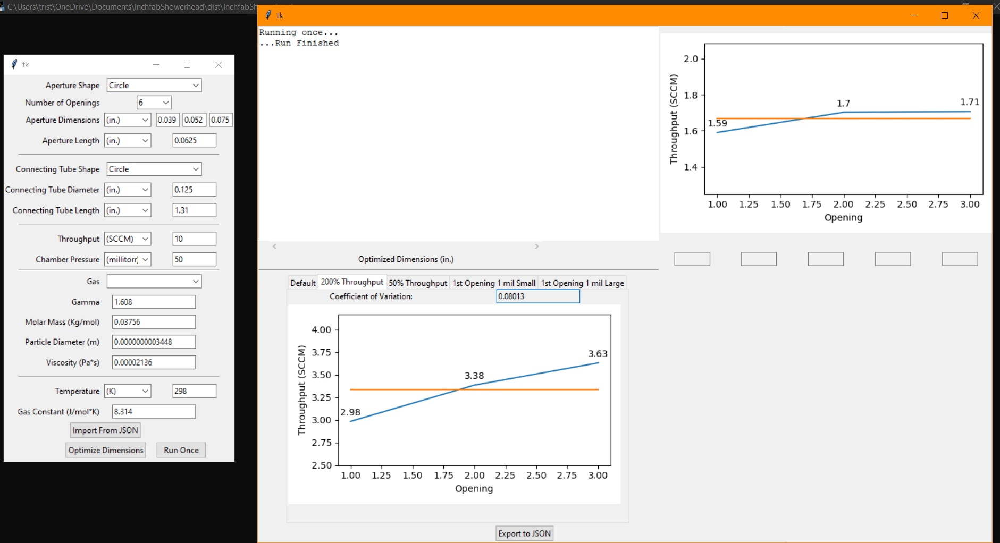

# Inchfab Showerhead
Inchfab showerhead is a python application that simulates gas flow in through a shower head. This simulation is used 
mostly to optimize the dimensions of apertures to provide symmetric flow of gas to a vacuum chamber.

## Installation
Download and unzip the project in any location.

## Usage
In the dist folder, there is a file named InchfabShowerhead.exe. Run it as you would any other program.
Make sure the GasData folder and blank.png are in the same location.

